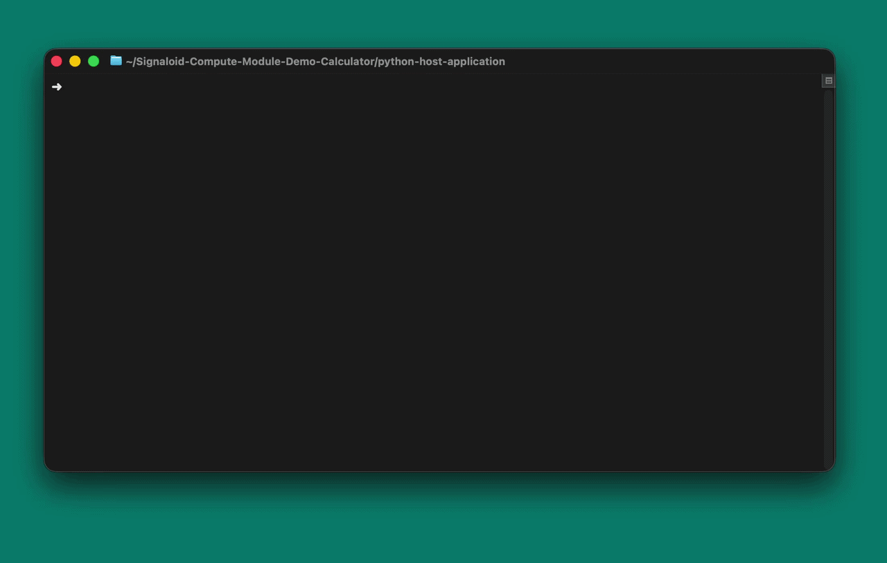

# Signaloid-Compute-Module-Demo-Calculator

This is a demo application for the Signaloid compute modules implementing a
simple distributional arithmetic calculator and sample generator.

This demo application supports the following operations:

- Arithmetic operations of two uniform distributions:
    - Addition
    - Subtraction
    - Multiplication
    - Division
- Sampling from an example built-in distribution.



## Compatibility

This demo currently supports:

- **Signaloid C0-microSD**
- **Signaloid C0-microSD+**
- **Signaloid C0-SD**

## Cloning this repository

Clone this repository recursively to get all its submodules:

```sh
git clone --recursive https://github.com/signaloid?q=Signaloid-Compute-Module-Demo-Calculator
```

To update all submodules:

```sh
git pull --recurse-submodules
git submodule update --remote --recursive
```

If you did not clone with `--recursive` and ended up with empty submodule
directories, you can fetch them with:

```sh
git submodule update --init --recursive
```

## Getting started

### Project structure

- `python-host-application/`: contains the source code that runs on the host
  machine that communicates with the Signaloid compute modules.
- `signaloid-soc-application/`: contains the source code and build-configuration
  for building the application for the Signaloid SoC in the compute modules.

### Configure the `Makefile`

1. Configure the `DEVICE` variable. This is the path where your compute module
   is located (e.g. /dev/disk4).
2. Configure the `DEVICE_TYPE` variable for your compute module. This is the
   compute module hardware variant you are using. The supported options are:
    - `SIGNALOID_C0_MICROSD`
    - `SIGNALOID_C0_MICROSD_PLUS`
    - `SIGNALOID_C0_SD`.
3. Configure the `CORE_ID` variable matching your compute module type. This
   controls the precision and correlation tracking for your application.
   default: `C0-*-N` core.

### Build the Compute Module application

The Makefile compiles the Signaloid SoC application on the Signaloid Cloud
Compute Engine using the
[Signaloid CLI](https://docs.signaloid.io/docs/api/signaloid-cli/intro/). The
`Makefile` (at the repository root) uses the CLI to connect this repository,
start a build in the Signaloid Cloud Compute Engine, and download the resulting
`main.bin`. The build inputs (source files and include paths) are defined in
`signaloid-soc-application/config.mk`.

#### Prerequisites:

- A supported Signaloid compute module (see compatibility above) and its device
  path on your host.
- A [Signaloid account](https://get.signaloid.io).
- A GitHub account connected to your Signaloid account, as shown in the
  [GitHub Login guide](https://docs.signaloid.io/docs/platform/user-interface/repositories/github-login/),
  so you can build it on the
  [Signaloid Cloud Developer Platform](https://signaloid.io). You can also fork
  this demo repository, push your changes, and build your own version.
- An API key for authentication.
  [Create one here](https://signaloid.io/settings/api).
- The [Signaloid CLI](https://docs.signaloid.io/docs/api/signaloid-cli/intro/)
  installed and authenticated as shown in its
  [installation](https://docs.signaloid.io/docs/api/signaloid-cli/installation/)
  and
  [authentication](https://docs.signaloid.io/docs/api/signaloid-cli/authentication/)
  documentation.
- **Python 3.10 or later** for the host application and the flashing toolkit.
- Root privileges (`sudo`) for raw block-device access.

#### Build the firmware

To build, run `make`. This connects the repository (first run only), starts a
cloud build, waits for it to finish, and downloads `main.bin` into the
repository root.


### Flash the Compute Module application

1. Make sure you have correctly configured the `DEVICE` and `DEVICE_TYPE`
   variables in the `Makefile` as described above.
2. Run `make flash`. This flashes the `<build-id>.main.bin` (it builds and
   downloads it first, if needed).
3. If you are targeting a Signaloid C0-microSD, you will be asked to power cycle
   the device to switch modes (Bootloader, Signaloid SoC). The device will have
   finished flashing when the green LED is solid.

## Host application

The host application is designed to parse two input arguments. Each argument
specifies a uniform distribution, represented in the the
[concise form of uncertainty notation](https://physics.nist.gov/cgi-bin/cuu/Info/Constants/definitions.html),
i.e., `X.Y(Z)`. The application supports addition, subtraction, multiplication,
and division of the input arguments. The input arguments must be quoted in a
linux shell.

### Run the Python based host application

To run the Python-based host application you first need to install its
dependencies. To do that:

1. Create a virtual environment: `python3 -m venv .venv`
2. Activate the virtual environment: `source .venv/bin/activate`
3. Navigate to `./python-host-application`
4. Install the requirements: `pip install -r requirements.txt`

### Example command

> [!IMPORTANT]
>
> Root privileges are required for raw access to the block device.
>
> We invoke the virtual environment's interpreter directly (`.venv/bin/python3`)
> because a plain `sudo python3` would use the system Python without the
> packages installed in the virtual environment.

> [!NOTE]
> Following examples assume a C0-microSD device located at `/dev/disk4`.

Add the value `1.0` with a tolerance of `±0.5` and the value `1.0` with a
tolerance of `±0.5`.

```sh
sudo .venv/bin/python3 ./python-host-application/host_application.py --device-path /dev/disk4 --variant C0-microSD add "1.0(5)" "1.0(5)"
```

Multiply the value `2.0` with a tolerance of `±0.5` and the value `5.0` with a
tolerance of `±0.3`.

```sh
sudo .venv/bin/python3 ./python-host-application/host_application.py --device-path /dev/disk4 --variant C0-microSD mul "2.0(5)" "5.0(3)"
```

Generate 100 samples from the built-in example distribution.

```zsh
sudo python host_application.py /dev/disk4 --device-path /dev/disk4 --variant C0-microSD sample --count 100
```

### Usage

```sh
usage: host_application.py [-h] [-d DEVICE_PATH] [-v {C0-microSD,C0-microSD+,C0-SD}] [-r] [-s] [--benchmark] [--iterations ITERATIONS] {add,sub,mul,div,sample} ...

Host application for the Signaloid C0 compute modules calculator demo

positional arguments:
  {add,sub,mul,div,sample}
                        Commands
    add                 Add two uniform distributions X, Y
    sub                 Subtract two uniform distributions X, Y
    mul                 Multiply two uniform distributions X, Y
    div                 Divide two uniform distributions X, Y
    sample              Get samples from example built-in distribution

options:
  -h, --help            show this help message and exit
  -d, --device-path DEVICE_PATH
                        Path of the C0 compute module device (e.g., /dev/disk4)
  -v, --variant {C0-microSD,C0-microSD+,C0-SD}
                        Hardware variant (default: C0-microSD+)
  -r, --reset-on-launch
                        Reset the core on launch. Ignored on the C0-microSD.
  -s, --stop-on-exit    Stop the core on exit. Ignored on the C0-microSD.
  --benchmark           Enable benchmarking
  --iterations ITERATIONS
                        Benchmarking iterations. Default: 20
```
